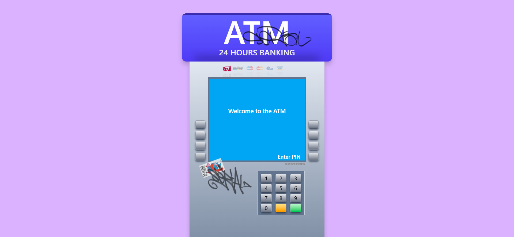
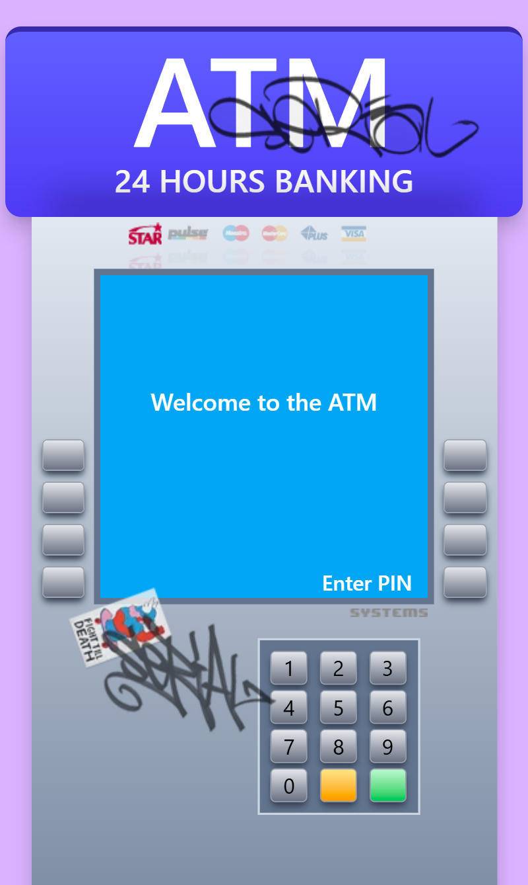
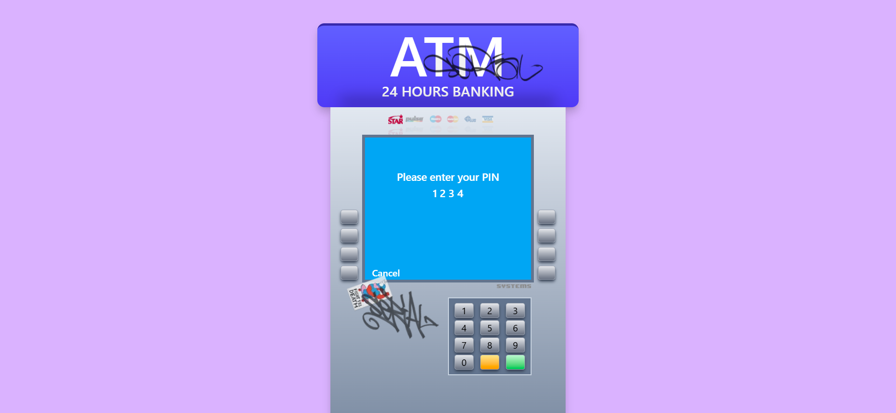
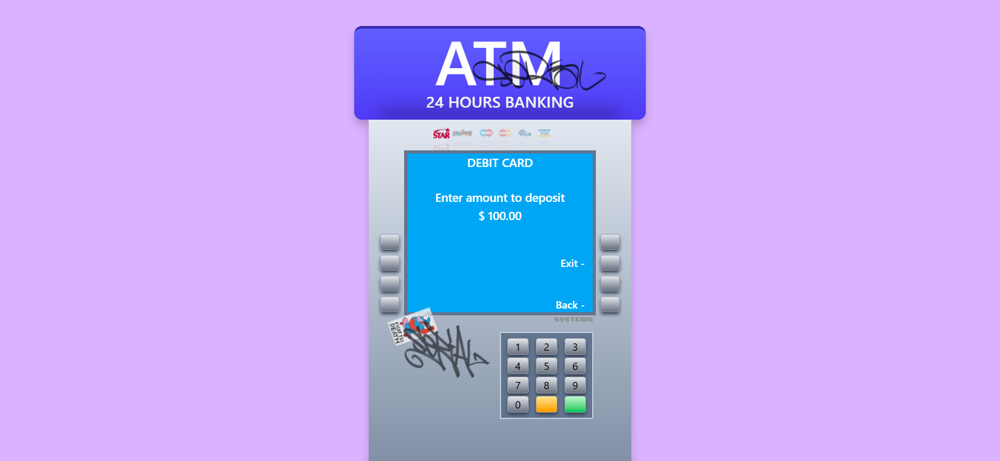

[](https://github.com/AlexisMerlin/atm-demo-app/actions/workflows/main-deploy.yml)

# ATM APP

ATM APP is a virtual ATM machine simulation built with Next.js and Redux. This application allows users to interact with an ATM interface, enter their PIN, check their balance, and perform deposit and withdrawal transactions. The project demonstrates state management using Redux Toolkit, including slices for handling ATM state, client authentication, and UI updates.

## Features

- **Authentication**: Users enter a PIN to authenticate.
- **Withdraw & Deposit**: Perform money transactions with balance validation.
- **Balance Check**: Display the user's current balance.
- **State Management**: Redux slices manage ATM states, client details, and UI interactions.
- **UI Middleware**: Synchronizes UI state changes with ATM actions.

## Project Structure

```
/atm-app
│── /app
│   ├── layer.tsx       # Main Layout
│   ├── page.tsx        # Render main page
│── /components         # All ATM components
│── /hooks              # Custom hooks. Handles UI updates
│── /providers          # Provider for ReduxJS store management
│── /store
│   ├── atm.slice.ts    # Manages ATM states
│   ├── client.slice.ts # Handles user authentication and transactions
│   ├── ui.slice.ts     # Controls UI state and buttons
│   ├── uiMiddleware.ts # Middleware for updating UI based on ATM state
│   ├── store.ts        # Redux store configuration
│── /types              # Common needed types

```

## Running the Project Locally

Install dependecies:

```sh
npm install
```

Start the development server:

```sh
npm run dev
```

The application will be available at `http://localhost:3000`.

## Running Tests

The application includes unit tests for Redux slices and store. To execute the tests:

```sh
npm run test
```

## Technologies Used

- **Next.js** – React framework for server-side rendering
- **Redux Toolkit** – State management
- **TypeScript** – Type safety
- **Jest & Testing Library** – Unit testing

## Screenshots

The ATM application is designed for desktop and movbile devices

 

**Numeric pad** allow to input pin or amount for **Withdraw & Deposit**. User can click on buttons or use keyboard in desktop version. Every num pad interaction should be done by click **green** acept button, or clean input by click **yellow** button





## Live Demo
[Live Demo Available Here](https://atm-demo-app-production.up.railway.app/)

## License

This project is licensed under the MIT License.
